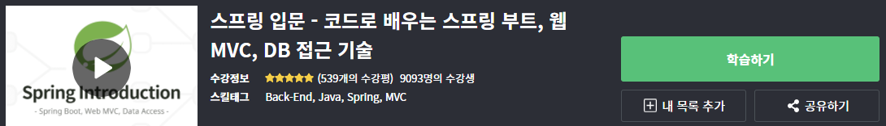

# <strong>방학동안 Spring Boot 공부하기</strong>  

방학동안 새로운 백엔드 언어인 SpringBoot 공부를 시작하기로 마음먹었다. 지금까지 Node.js를 백엔드 개발언어로 선택하여 개발에 사용했지만, 국내 많은 기업에서 사용하는 Spring을 공부할 필요가 있다고 느꼈고 Spring을 학습하기 전에 우선 방학 기간 동안 SpringBoot를 먼저 공부하기로 다짐했다.

## <strong>Spring Boot란?</strong>

`Spring framework`는 기능이 많은만큼 환경설정이 다소 복잡한 편이다. 이에 어려움을 느끼는 사용자들을 위해 나온 것이 바로 `Spring Boot`다. `Spring Boot`는 `Spring framework`를 사용하기 위한 설정의 많은 부분을 자동화하여 사용자가 편하게 `Spring`을 활용할 수 있도록 도와준다. `spring boot starter dependency`만 추가해주면 바로 `API`를 정의하고, 내장된 `Tomcat`이나 `Jetty`로 웹 애플리케이션 서버를 실행할 수 있다. 추가적으로, 스프링 홈페이지의 이니셜라이저를 사용하면 바로 실행 가능한 코드를 만들어준다. 사용자는 실행환경이나 의존성 관리 등의 인프라 관련 작업은 신경쓰지 않고 바로 코딩을 시작할 수 있다. 쉽게 말해, 우리는 `Spring Boot`를 이용해서 `Spring`기반 애플리케이션을 쉽게 만들 수 있다는 소리다. 사용자들은 이러한 부분들에서 `Spring Boot`의 큰 매력을 느낄 수 있다.

`Spring Boot`의 특징은 다음과 같다.
> 단독으로 실행이 가능한 `Spring Application`을 생성한다.   
> `Tomcat`, `Jetty`, `Undertow`를 내장한다.  
> 기본 설정이 되어있는 `starter component`를 제공한다.  
> 가능한 자동으로 설정되어 있다.  
> 상용화에 필요한 통계, 상태 체크, 외부 설정등을 제공한다.  
> 설정을 위한 XML 코드를 생성하거나 요구하지 않는다.

#### <strong>Spring Boot는 한마디로</strong>
`Java`를 사용하여 애플리케이션을 쉽고, 빠르고, 간편하게 개발할 수 있게 각종 라이브러리들을 모아둔 도구이다. 

## <strong>학습 계획</strong>

우선 인프런에 올라와있는 강의를 시청하며 기본적인 기술들을 익힐 생각이다. 해당 강의 동영상은 우아한형제들에서 무료로 제공하는 입문자 강의 동영상이며, 총 28강 321분으로 이루어져있다.

`Java`를 기반으로 사용하기 때문에 `Java`에 대한 지식도 있어야 한다. 학교 알고리즘 수업을 `Java`로 했었고 어느 정도 익숙하기 때문에 큰 문제는 없을 것 같다. 혹여 `Java`를 다루는 데에 있어 문제가 발생하면 그때 그때 필요한 검색을 통해 익히면 될 것 같다.  
강의 진도를 다 끝내면 작은 규모의 연습용 개인 프로젝트를 진행해보면서 `Spring Boot`의 입문 과정을 마치면 될 것 같다.
