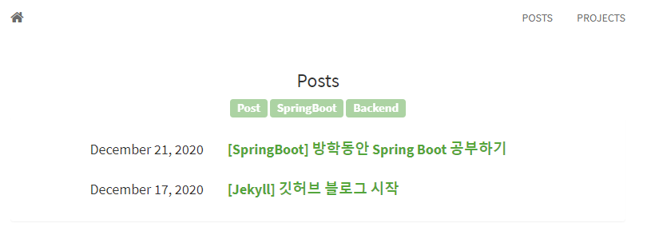

# <strong>블로그에 테마 기능 추가하기</strong>  

블로그에 있는 모든 글들을 글을 쓴 목적에 맞게 분류하면 보는 사람이나 작성한 사람이나 더 편하게 블로그를 이용할 수 있을 것이란 생각을 이전부터 했다. 테마 기능을 언제 추가할까 생각만 했는데 오늘 들어야할 Spring Boot 강의를 끝내고 시간이 남아 블로그에 테마 기능을 추가했다.

## <strong>반응형 tag 기능🖱</strong>

`TAGS`라는 카테고리를 `navbar`에 추가 시키지 않고, `POSTS`에 들어가면 전체 태그도 함께 보여주도록 했다. 그리고 사용자가 원하는 `tag`를 클릭하면 해당 `tag`에 맞는 글들만 사용자에게 보여준다. 그리고 당연히 해당 `tag botton`은 반응형이다.

`tag` 기능 추가 과정을 다음과 같이 요약해봤다.
> `_data` 폴더 생성, 해당 폴더에 `format.yml`, `tags.yml`파일 생성    
> `tags.yml`에는 내가 사용할 `tag`목록을 적어준다.  
> `format.yml`에는 마크다운에 추가한 `tag`형식을 통일시켜 변환해준다.  
> `posts.html`에 `tag`목록을 보여주는 코드를 추가시킨다.  
> 마지막으로, `_layouts/layout.html`에 동적으로 페이지를 변형시켜주는 스크립트 함수를 추가한다.  

`tag`에 맞는 포스트 수가 몇 개인지는 중요하지 않을 것 같아 포스트의 수는 추가 시키지 않았다. `category` 기능도 추가시키려고 했는데 오늘 추가한 `tag` 기능이 `category` 기능까지 충분히 대체할 수 있다고 생각해 추가하지 않았다. 좀 더 깔끔하고 효율적인 블로그가 된 것 같아 기분이 좋다.😁😁😁