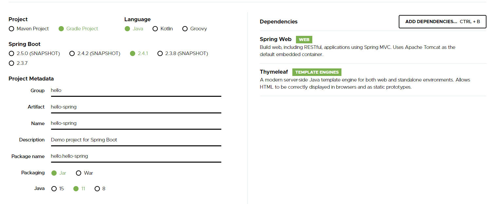
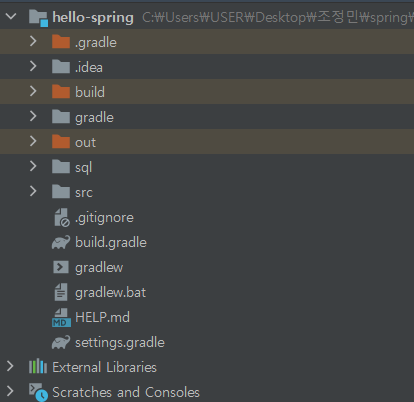
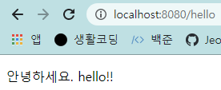

# <strong>Spring Boot 기초 다지기</strong>  

## <strong>본격적인 학습을 하기 전에<strong>
우선 `Java 11`과 `IDE`가 설치되어있어야 한다. `Java 8`이 이미 노트북에 설치가 되어있었지만 강의에서 `Java 11` 이외의 버전을 사용하면 정상 동작하지 않을 가능성이 높다는 주의를 줬기에 `Java 11`로 다시 설치했다. `IDE`로는 `Eclipse`와 `IntelliJ` 중에 `IntelliJ`를 선택했다. 
> Java ver.: 11  
> IDE: IntelliJ

## <strong>Spring Initializr 사용</strong>
강의에서는 Spring Boot Project를 쉽게 만드는 방법으로 `Spring Initializr`를 소개했다.


Project는 `Gradle`, `Java`, `2.4.1`로 설정했고, Project Metadata의 Group은 `hello`, Artifact는 `hello-spring`으로 설정했다. Dependencies로는 `Spring Web`, `Thymeleaf`를 선택하여 프로젝트를 생성했다.

생성된 프로젝트 폴더는 다음과 같이 형성된다.  


`src/main/resources/static`에는 정적인 html 파일을 저장시켜준다. `src/main/resources/templates`에는 동적으로 보여질 html 파일을 저장하면 된다.

`src/main/java/hello.hellospring/contoller/HelloController.java`
```java
@Controller
public class HelloController {
    @GetMapping("hello")
    public String hello(Model model) {
        model.addAttribute("data", "hello!!");
        return "hello";
    }
}
```

`src/main/resources/templates/hello.html`
```html
<!DOCTYPE HTML>
<html xmlns:th="http://www.thymeleaf.org">
<head>
    <title>Hello</title>
    <meta http-equiv="Content-Type" content="text/html; charset=UTF-8" />
</head>
<body>
    <p th:text="'안녕하세요. ' + ${data}" >안녕하세요. 손님</p>
</body>
</html>
```
`templates` 폴더에 동적으로 보여줄 `hello.html` 파일을 하나 생성했고, `controller` 폴더를 생성한 후 `HelloController.java` 파일을 생성했다. `HelloController.java`에서 `@GetMapping`은 url을 의미한다. `return`의 문자열은 해당 이름의 html 파일을 의미한다. 웹 브라우저에서 localhost:8080/hello를 요청하면 내장 톰켓 서버를 통해 스프링 컨테이너에서 `HelloController.java`를 실행시키고 Thymeleaf 템플릿 엔진 처리를 거쳐 `viewResolver`가 `hello.html`을 찾아 처리한다. 이 때 `HelloController.java`의 `model(data: hello!!)`은 `hello.html`에 넘겨지게 된다.  
만약, `controller` 파일이 없다면 스프링부트는 `static` 폴더에 있는 정적 index.html을 띄워준다.



## <strong>느낀점</storng>
`Node.js`를 사용하다 `Spring Boot`를 시작하니 아직은 익숙하지 않고, 어색하다. 그래도 기초 내용이라 어렵다고 느낀 부분은 없었다. 아직 배울 부분이 산더미지만 흥미가 있기 떄문에 부담없이 강의를 진행할 수 있을 것 같다.